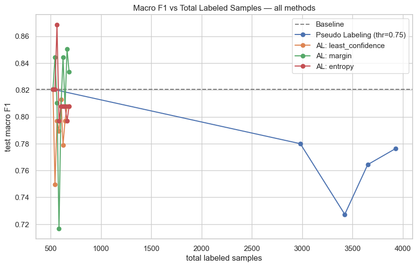

# 🏎️ F1 Pit Strategy Prediction — Semi-Supervised & Active Learning

Predicting the **strategic reason behind a Formula 1 pit stop** — *Standard*, *Undercut*,
*Overcut*, or *Emergency* — from lap-level race data, and comparing how much labeled data
you actually need to get there using three approaches: a **fully supervised baseline**,
**Pseudo Labeling** (semi-supervised learning), and **Active Learning**.

> Built on the [Formula 1 World Championship (1950–2024)](https://www.kaggle.com/datasets/rohanrao/formula-1-world-championship-1950-2020) Kaggle dataset (Ergast F1 data).

---

## 📌 Why this project

Real pit-strategy calls are rarely logged with an explicit "why" — you see *that* a driver
pitted, not whether it was a planned undercut, a reactive overcut, or a forced stop after a
problem. Labeling every historical stop by hand doesn't scale. This project asks: **if only
a small fraction of stops are labeled, how far can semi-supervised and active learning push
model performance before you run out of cheap labels?**

## 🧠 What the notebook does

1. **Data loading & joining** — merges `races`, `pit_stops`, `lap_times`, `results`,
   `driver_standings`, `constructor_standings`, `constructors`, `drivers`, and `circuits`
   into one row per pit stop (2014–2024, the modern hybrid/Pirelli era).
2. **Feature engineering**
   - `lap_time_delta`, `laps_since_last_pit`, `laps_remaining`, `approx_gap_ahead`,
     `approx_gap_behind`, `safety_car_likely` (required features)
   - `gap_ahead_trend`, `position_deficit` (bonus, hand-designed features)
3. **Rule-based strategy labeling** — a priority-ordered heuristic assigns each stop a label
   (`Emergency` → `Undercut` → `Overcut` → `Standard`) from data-driven quantile thresholds.
4. **Labeled / unlabeled split** — a small `labeled.csv` slice simulates the "expensive to
   annotate" real-world scenario; the rest becomes the unlabeled pool.
5. **EDA** — class balance, feature distributions per strategy, a KS-test check that the
   labeled/unlabeled split isn't biased, and constructor/circuit patterns.
6. **Supervised baseline** — Logistic Regression, Random Forest, Gradient Boosting compared;
   best model evaluated with macro-F1, confusion matrix, and feature importances.
7. **Pseudo Labeling** — iteratively retrains on high-confidence predictions from the
   unlabeled pool at several confidence thresholds (0.55–0.85), tracking how confirmation
   bias affects minority classes.
8. **Active Learning** — uncertainty sampling (least-confidence, margin, entropy) queries a
   simulated oracle for a handful of the most informative unlabeled points per round.
9. **Comparative analysis** — macro-F1 vs. number of labels used, ROC/AUC, and learning
   curves for all three approaches side by side.

## 📊 Results


| Method | Labels used | Macro F1 |
|---|---|---|
| Supervised baseline | 523 | 0.821669 |
| Pseudo Labeling (best threshold) | 3926 | 0.776225 |
| Active Learning (best strategy) | 683 | 0.833639|

## 🖼️ Sample plots



## 📂 Repo structure

```
.
├── f1_pit_strategy_ssl_active_learning.ipynb   # main notebook
├── data/                                       # raw Kaggle CSVs (not tracked in git)
├── requirements.txt
└── README.md
```

## 🚀 Getting started

1. **Get the data** — download the
   [Formula 1 World Championship (1950–2024)](https://www.kaggle.com/datasets/rohanrao/formula-1-world-championship-1950-2020)
   dataset from Kaggle and place the CSVs (`races.csv`, `pit_stops.csv`, `lap_times.csv`,
   `results.csv`, `driver_standings.csv`, `constructor_standings.csv`, `constructors.csv`,
   `drivers.csv`, `circuits.csv`) in a local `data/` folder next to the notebook.
2. **Install dependencies**
   ```bash
   pip install -r requirements.txt
   ```
3. **Run the notebook**
   ```bash
   jupyter notebook f1_pit_strategy_ssl_active_learning.ipynb
   ```
   Run all cells top to bottom — later sections depend on variables defined earlier
   (`labeled`/`unlabeled` split, `X_train`/`X_test`, `BASELINE_MACRO_F1`, etc.).

## 🛠️ Tech stack

`pandas` · `numpy` · `scikit-learn` · `matplotlib` · `seaborn` · `scipy`

## 📝 Notes & caveats

- `safety_car_likely` is a heuristic proxy (many drivers unusually slow on the same lap),
  not official SC/VSC flag data — the raw Ergast dataset doesn't include race-control flags.
- The labeling function is rule-based (used as a simulated "oracle" for active learning),
  not ground-truth strategist annotation — a natural next step would be validating it
  against real strategy commentary or team radio data.
- Numeric thresholds for the labeling rules are derived from the data's own quantiles and
  tuned to land inside target class-balance ranges; re-check them if you re-run on a
  different season range.

## 📄 License

MIT — see [LICENSE](LICENSE).
